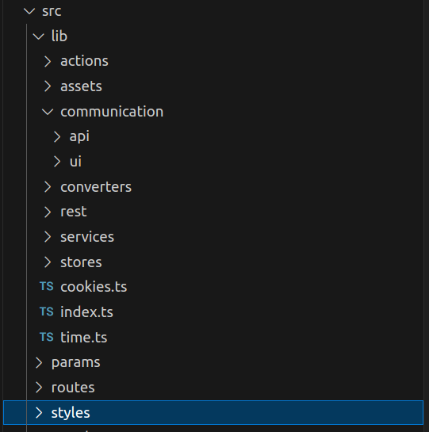
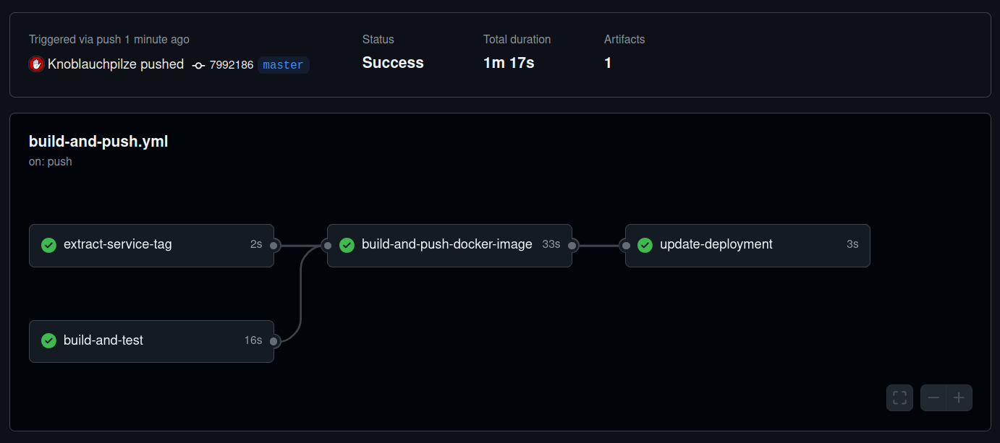
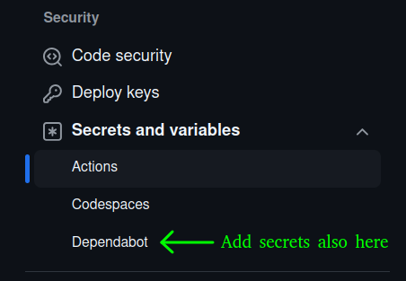

# template-frontend

This repository defines a scaffolding project to kick-start a frontend application. It is meant to work best with a backend created using the [template-go](https://github.com/Knoblauchpilze/template-go) repository.

Below is a gallery of images from this project:


Shortly described, this project provides a minimalistic frontend to allow users to login/logout and display information about them.

# Badges

[](https://github.com/Knoblauchpilze/template-frontend/actions/workflows/build-and-push.yml)

[](https://codecov.io/gh/Knoblauchpilze/template-frontend)

# Why this project?

When building a new app or website, it is common to have a back-end service and to want to present a visual representation of the data to the user through a frontend website. By doing this, there's usually a bare minimum amount of code that always has to be present: the layout, the components and in general some common code to provide a CI or deployment somewhere.

The [frontend-toolkit](https://github.com/Knoblauchpilze/frontend-toolkit) package already provides some building block that can be used as is. This project goes a step further by integrating this package into a fully functional project.

# What does this project bring?

By creating a frontend project with this repository, you will have out of the box:

- a working website using the [svelte](https://svelte.dev) framework.
- access to easy styling with [tailwindcss](https://tailwindcss.com).
- a CI allowing to run unit tests and check code style.
- a working docker build step to push the service as a container to [dockerhub](https://hub.docker.com/).

ℹ️ **Note:** The code present in this repository is a mixture of using the [svelte cli](https://github.com/sveltejs/cli) to generate a scaffolding of a project and copying bits and pieces of the frontend services we already built.

# How does this project work?

## General structure

The project is structured as a classical `svelte` app using `tailwindcss` for styling components.

In addition to this, we provide a [Dockerfile](build/Dockerfile) to build the container attached to this project. This helps to easily make the result of the build available to deploy where needed.

This project also provides a working CI through github actions: it will automatically trigger the build on each commit and verify that:

- the code style is correct.
- tests are passing.
- the docker image can be built.

It will also push this image to `dockerhub`. On `master` it will also come with an update to the [ec2-deployment](https://github.com/Knoblauchpilze/ec2-deployment) with the newly created tag for the service: this will automatically deploy the newest version to the cluster when the CI is green. By default this will push to the `ec2-deployment` repository but can be updated easily to something else.

## The lib folder

The [lib](src/lib) folder contains the base utilities which were always necessary when building a frontend service. This includes:
* some way to center the content on screen.
* a bunch of stores to modify transient properties of the app (such as the page title).
* DTOs to manage communication with the back-end services.
* services to perform the communication with the back-end services.
* a generic asset to represent 

The structure of the folder is designed to be extensible easily:



Although the service is quite minimalistic it defines some components which are very likely to be needed in other projects.

## The routes

This project defines a couple of routes to showcase the possibilities offered by `svelte`. Namely:
* some simple routes.
* a route with a named parameter.

The second point is interesting because it allows to parameterize the routes based on the resources managed by the back-end (and frontend) service. You can read more in the [Advanced routing](https://svelte.dev/docs/kit/advanced-routing) documentation page.


## The CI

The CI configured for this project will perform:
* check of the code style.
* run the tests.
* build and push the docker image for the service.
* update the deployment with the latest version of the service.

This is summarized by the execution graph below:



As represented by the badge in this README the coverage is not the highest currently but the goal is mainly to have a base to run tests to make it easier to write some in actual projects.

# How to use this project for a new service?

## Setting up the project

Using this project should be simple. The first step is to clone the repository and (optionally) rename the folder to the name of your new project:

```bash
git clone git@github.com:Knoblauchpilze/template-frontend.git
mv template-frontend MY-AWESOME-PROJECT-NAME
```

You can then execute the [configure](scripts/configure.sh) script to take care of the renaming of various aspects of the project to match the new desired name:

```bash
cd MY-AWESOME-PROJECT-NAME
./scripts/configure.sh MY-AWESOME-PROJECT-NAME
```

Finally you can set up the `.env` file to define the needed environment variable and install the dependencies using the `make` target:

```bash
make setup
make install
```

## Creating secrets

This repository expects at least two secrets to work properly: `DOCKERHUB_USERNAME` and `DOCKERHUB_TOKEN`. They correspond to information on how to access the `dockerhub` repository to push the docker image built for the service.

They are referenced in the [github workflow](https://github.com/Knoblauchpilze/template-frontend/blob/master/.github/workflows/build-and-push.yml#L51-L52): if you don't need to push to `dockerhub` then you can modify the workflow to suit your needs.

Due to the current configuration to push to the `ec2-deployment` repository, we also require a github token provided as a secret to push to this repository: this can be adapted to your own needs in a similar way.

Finally, although [dependabot](https://docs.github.com/en/code-security/dependabot) is configured, we chose to **disable the steps that require secrets** for workflows executed by the bot. In case you want to change this, you will need to provide the secrets also for dependabot (see this [documentation section](https://docs.github.com/en/code-security/dependabot/working-with-dependabot/automating-dependabot-with-github-actions#investigating-failed-workflow-runs) or issue [#3253](https://github.com/dependabot/dependabot-core/issues/3253) on this topic):



## Configuring access to other services

Out of the box this project comes with a configuration allowing to access two services:
* the user service (see [here](https://github.com/Knoblauchpilze/template-frontend/blob/master/src/lib/rest/api.ts#L2)).
* a customizable service (see [here](https://github.com/Knoblauchpilze/template-frontend/blob/master/src/lib/rest/api.ts#L1)).

Those variables are coming from the environment (see the [.env.example.local](https://github.com/Knoblauchpilze/template-frontend/blob/master/.env-example.local) file). Additionally those variables are also provided when building the docker file (see [Dockerfile](https://github.com/Knoblauchpilze/template-frontend/blob/master/build/Dockerfile#L6-L7)). Their values are used in convenience functions allowing to build URLs to request data from the services (see e.g. [buildUserUrl](https://github.com/Knoblauchpilze/template-frontend/blob/master/src/lib/rest/api.ts#L13)).

If needed, it is possible to modify/add/otherwise alter the values of those variables to contact other services: this allows to contact any back-end services as needed. This can be done by:
* added a descriptive line in the `.env.example.local` file.
* adding this line to the `Dockerfile` with a meaningful value.
* (optional, if needed) overrides this value in the CI.

## Working and developing on a new project

Assuming the previous steps have been completed, you can now use the other `make` target to start a development server and see the results of your changes:

```bash
make dev
```

In case new packages need to be installed you can execute the `install` target again. Before committing you can check the code style through the following command:

```bash
make lint
```
